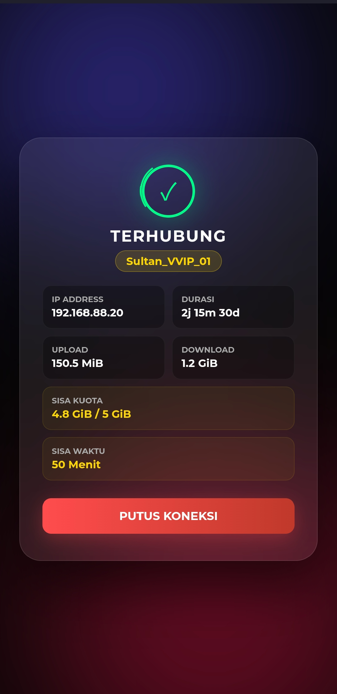

# Premium Gold Dark Hotspot Template

  
  &nbsp;&nbsp;&nbsp;&nbsp; 

Template Hotspot Mikrotik dengan desain modern, glassmorphism, dan animasi halus.
Cocok untuk Cafe, Warkop, atau Hotel yang mengutamakan kesan mewah.

## Fitur
- 🎨 **Modern UI:** Dark mode dengan aksen Gold & Glassmorphism.
- 📱 **Mobile Friendly:** Layout terkunci (Fixed Viewport), anti geser di HP.
- ⚡ **Lightweight:** Tanpa framework berat (Bootstrap/Tailwind), murni CSS.
- 🔄 **Dual Mode:** Mendukung Login Voucher & Member.
- 🛡️ **Error Handling:** Notifikasi error yang rapi dan estetik.

## Cara Pasang
1. Download repository ini.
2. Upload seluruh file ke dalam folder baru di Mikrotik (misal: `hotspot/gold`).
3. Ubah `HTML Directory` di Hotspot Server Profile ke folder tersebut.

## Credits
Dibuat dengan Gemini AI 🤭🤭🤭.